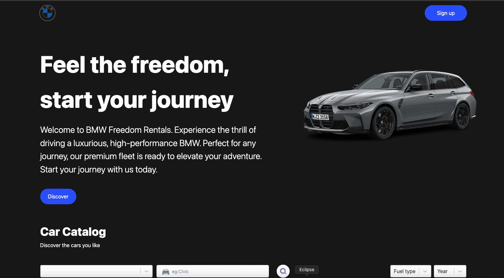
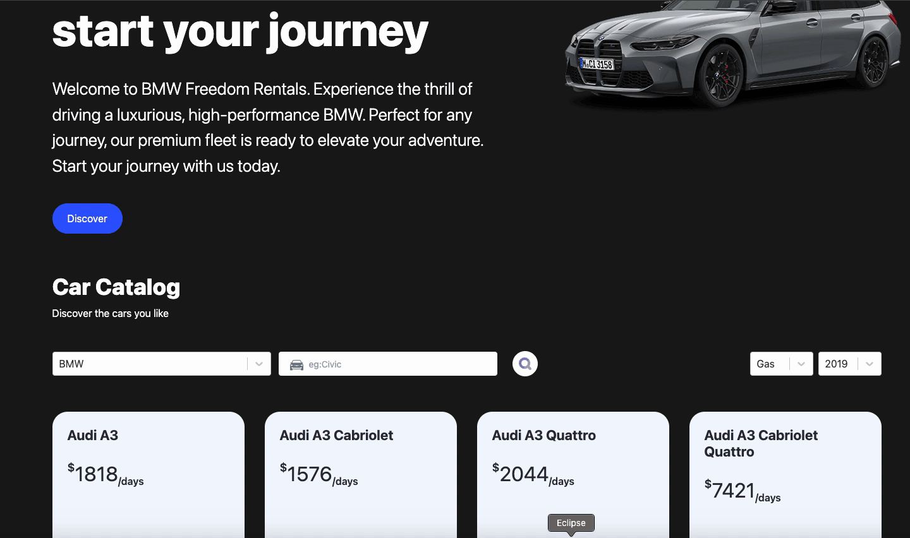
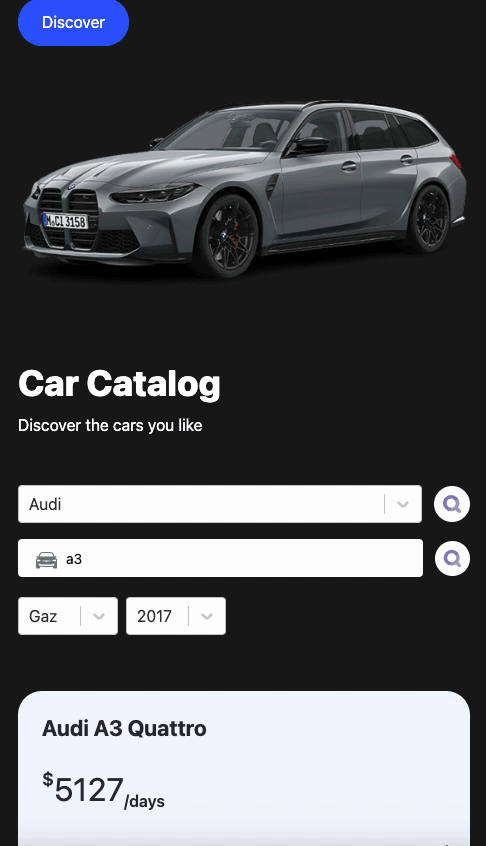

# <h1>TypeScript-RentCar-App</h1>

This car rental website is designed with a simple and user-friendly approach with multiple filtering features. It is designed as fully responsive.

<h2> Programming Languages Used</h2>

Website is coded with TSX CSS/TAILWIND & REACT.JS &TYPESCRIPT

# Librarys

- react-router-dom
- typescript
- react-select
- tailvind
- framer-motion 

<h2>Screen </h2>

